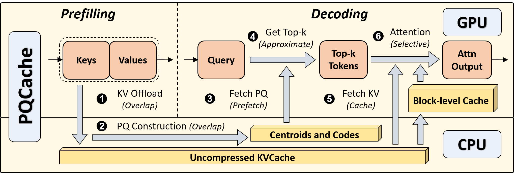

# [SIGMOD'25] PQCache: Product Quantization-based KVCache for Long Context LLM Inference ([Paper](https://arxiv.org/abs/2407.12820))

Codes for the SIGMOD 2025 paper "PQCache: Product Quantization-based KVCache for Long Context LLM Inference".


## Overview


As the field of Large Language Models (LLMs) continues to evolve, the context length in inference is steadily growing.
Key-Value Cache (KVCache), a crucial component in LLM inference, has now become the primary memory bottleneck due to limited GPU memory. 
Current methods selectively determine suitable keys and values for self-attention computation in LLMs to address the issue.
However, they either fall short in maintaining model quality or result in high serving latency.
Drawing inspiration from advanced embedding retrieval techniques used in the database community, we consider the storage and searching of KVCache as a typical embedding retrieval problem.
We propose **PQCache**, which employs Product Quantization (PQ) to manage KVCache, maintaining model quality while ensuring low serving latency.
During the prefilling phase, we apply PQ to tokens' keys for each LLM layer and head.
During the autoregressive decoding phase, for each newly generated token, we first identify important tokens through Maximum Inner-Product Search (MIPS) using PQ codes and centroids, then fetch the corresponding key-value pairs for self-attention computation.
Through meticulous design of overlapping and caching, we minimize any additional computation and communication overhead during both phases.
Extensive experiments show that PQCache achieves both effectiveness and efficiency. It maintains model quality even when only 1/5 of the tokens are involved in attention, while attaining acceptable system latency.



## Environment

We're using Conda to manage the Python environment. Please try building the Conda environment from the `env.yml` file. We install the "flash-attn" package from a downloaded wheel, so if you encounter any errors during installation, please try downloading and installing this package manually.

## Models
Currently supported models include [meta-llama/Llama-3.1-8B-Instruct](https://huggingface.co/meta-llama/Llama-3.1-8B-Instruct) and [mistralai/Mistral-7B-Instruct-v0.2](https://huggingface.co/mistralai/Mistral-7B-Instruct-v0.2).

## Quick Start

### Environment Setup

1. First compile lfucache for GPU cache:
```bash
cd vq_method/retrieval_based/lfu/
mkdir build; cd build; cmake ..; make
cd ../../../../
```

2. Download datasets:
   - For LongBench: Download to `./data/`
   - For SCBench: Run `python download_scbench.py`

3. [Optional] If you want to use local model checkpoints, modify `config/model2path.json`:
```json
{
    "mistral-7b-Instruct-32k": "[MISTRAL_MODEL_PATH]",
    "llama-3.1": "[LLAMA_MODEL_PATH]"
}
```

### LongBench Evaluation

```bash
export HF_ENDPOINT=https://hf-mirror.com
bash run_mistral.sh
bash run_llama.sh
```

Evaluation:
```bash
python eval.py --model llama-3.1 --dataset hotpotqa --exp_name pq_4321_rerun_v0
```

## SCBench Evaluation Tasks

SCBench (SharedContextBench) provides comprehensive evaluation of long-context methods across different KV cache lifecycle scenarios.

**Core Python Script**: `vq_pred_scbench_generic.py`

### 🎯 字符串检索任务 (关键KV随轮次强烈变化)

| 数据集 | 任务简称 | 描述 | 运行脚本 |
|--------|----------|------|----------|
| `scbench_kv.jsonl` | **Retr.KV** | 键值对检索 | `run_scbench_kv.sh` |
| `scbench_prefix_suffix.jsonl` | **Retr.Prefix-Suffix** | 前缀后缀检索 | `run_scbench_prefix_suffix.sh` |
| `scbench_vt.jsonl` | **Retr.MultiHop** | 多跳变量跟踪 | `run_scbench_vt.sh` |

### 🎯 语义检索任务 (长生成注意力迁移)

| 数据集 | 任务简称 | 描述 | 运行脚本 |
|--------|----------|------|----------|
| `scbench_repoqa.jsonl` | **Code.RepoQA** | 代码库检索与复现 | `run_scbench_repoqa_incremental.sh` |
| `scbench_qa_eng.jsonl` | **Language QA** | 英文问答 | `run_scbench_qa_eng.sh` |
| `scbench_qa_chn.jsonl` | **Language QA** | 中文问答 | `run_scbench_qa_chn.sh` |
| `scbench_choice_eng.jsonl` | **Multi-choice QA** | 英文选择题 | `run_scbench_choice_eng.sh` |

### 🎯 全局信息处理任务 (海量输入→极短输出)

| 数据集 | 任务简称 | 描述 | 运行脚本 |
|--------|----------|------|----------|
| `scbench_mf.jsonl` | **Math.Find** | 长数组统计 | `run_scbench_mf.sh` |
| `scbench_many_shot.jsonl` | **ICL.ManyShot** | hundreds-shot ICL | `run_scbench_many_shot.sh` |
| `scbench_summary.jsonl` | **En.Sum** | 英文摘要 | `run_scbench_summary.sh` |

### 🎯 多任务组合 (多步骤推理)

| 数据集 | 任务简称 | 描述 | 运行脚本 |
|--------|----------|------|----------|
| `scbench_summary_with_needles.jsonl` | **Mix.Sum+NIAH** | 摘要+针海查找 | `run_scbench_summary_with_needles.sh` |
| `scbench_repoqa_and_kv.jsonl` | **Mix.RepoQA+KV** | 代码检索+键值查找 | `run_scbench_repoqa_and_kv_incremental.sh` |

### 使用示例

```bash
# 运行单个任务
bash run_scbench_kv.sh

# 运行所有任务
bash run_all_scbench_tasks.sh

# 数学推理任务
bash run_math_500.sh    # Math-500数据集
bash run_math_aime.sh   # AIME 2024数据集
```

### 结果保存

- **增量保存**: 每完成一个样本自动保存，防止长时间运行中断丢失结果
- **最终结果**: 保存在对应的 `pred/` 目录下
- **日志文件**: 运行过程中的详细日志保存为 `.log` 文件

## Code Structure

Our codes are mainly in the `vq_method` directory.
```
- retrieval_based
    - lfu: codes for GPU cache.
    - cache_manager.py: codes for cache management.
    - multi_core_compressor_v2.py: codes for multi-CPU-core compression.
    - pq_search.py: codes for PQ compressor.
- mistral_patch.py: codes for replacing the original attention in Mistral.
- llama31_patch.py: codes for replacing the original attention in Llama-3.1.
```


## Acknowledgement
During the development and implementation of PQCache, we learned a lot and borrowed some codes from the following projects.

[LongBench](https://github.com/THUDM/LongBench)  
[H2O](https://github.com/FMInference/H2O)  
[InfLLM](https://github.com/thunlp/InfLLM)  
[SPARQ](https://github.com/graphcore-research/llm-inference-research/tree/2024-01-paper)  
[Hetu](https://github.com/PKU-DAIR/Hetu)

## Citation
If you find this work useful, please cite [our paper](https://arxiv.org/abs/2407.12820).
